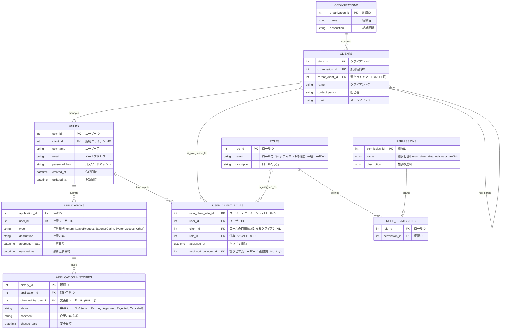

```mermaid
erDiagram
    ORGANIZATIONS ||--o{ CLIENTS : contains
    CLIENTS ||--o{ CLIENTS : has_parent
    CLIENTS ||--o{ USERS : manages
    USERS ||--o{ APPLICATIONS : submits
    APPLICATIONS ||--o{ APPLICATION_HISTORIES : tracks

    USERS ||--o{ USER_CLIENT_ROLES : has_role_in
    CLIENTS ||--o{ USER_CLIENT_ROLES : is_role_scope_for
    ROLES ||--o{ USER_CLIENT_ROLES : is_assigned_as

    ROLES ||--o{ ROLE_PERMISSIONS : defines
    PERMISSIONS ||--o{ ROLE_PERMISSIONS : grants

    ORGANIZATIONS {
        int organization_id PK "組織ID"
        string name "組織名"
        string description "組織説明"
    }

    CLIENTS {
        int client_id PK "クライアントID"
        int organization_id FK "所属組織ID"
        int parent_client_id FK "親クライアントID (NULL可)"
        string name "クライアント名"
        string contact_person "担当者"
        string email "メールアドレス"
    }

    USERS {
        int user_id PK "ユーザーID"
        int client_id FK "所属クライアントID"
        string username "ユーザー名"
        string email "メールアドレス"
        string password_hash "パスワードハッシュ"
        datetime created_at "作成日時"
        datetime updated_at "更新日時"
    }

    APPLICATIONS {
        int application_id PK "申請ID"
        int user_id FK "申請ユーザーID"
        string type "申請種別 (enum: LeaveRequest, ExpenseClaim, SystemAccess, Other)"
        string description "申請内容"
        datetime application_date "申請日時"
        datetime updated_at "最終更新日時"
    }

    APPLICATION_HISTORIES {
        int history_id PK "履歴ID"
        int application_id FK "関連申請ID"
        int changed_by_user_id FK "変更者ユーザーID (NULL可)"
        string status "申請ステータス (enum: Pending, Approved, Rejected, Canceled)"
        string comment "変更内容/備考"
        datetime change_date "変更日時"
    }

    ROLES {
        int role_id PK "ロールID"
        string name "ロール名 (例: クライアント管理者, 一般ユーザー)"
        string description "ロールの説明"
    }

    PERMISSIONS {
        int permission_id PK "権限ID"
        string name "権限名 (例: view_client_data, edit_user_profile)"
        string description "権限の説明"
    }

    ROLE_PERMISSIONS {
        int role_id FK "ロールID"
        int permission_id FK "権限ID"
    }

    USER_CLIENT_ROLES {
        int user_client_role_id PK "ユーザー・クライアント・ロールID"
        int user_id FK "ユーザーID"
        int client_id FK "ロールの適用範囲となるクライアントID"
        int role_id FK "付与されたロールID"
        datetime assigned_at "割り当て日時"
        int assigned_by_user_id FK "割り当てたユーザーID (監査用, NULL可)"
    }
```
